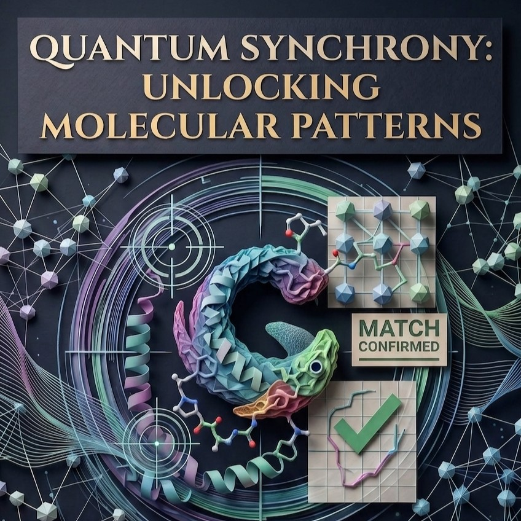

# Project Q-Rotate: Efficient Molecular Pattern Matching

**Team:** Eve Count (`1ightray`)  
**Core Team & Collaborators:**
* **Benjamin Lim** ([ben@evecount.com](mailto:ben@evecount.com)) — Eve Count
* **James Sun** ([james@mambapartners.com](mailto:james@mambapartners.com)) — Mamba Partners

**Track:** Chemistry and Biomolecular Simulation  
**Event:** Quantinuum SG Grand Challenge 2026  
**Live Interactive Documentation:** [evecount.github.io/quantum_rotation](https://evecount.github.io/quantum_rotation/)  
**Repository:** [github.com/evecount/quantum_rotation](https://github.com/evecount/quantum_rotation)  
**Aqora Workspace:** [aqora.io/1ightray/sg-grand-challenge-evecount](https://aqora.io/1ightray/sg-grand-challenge-evecount)



---

## 1. Overview

Project Q-Rotate replaces traditional, computationally expensive 3D spatial docking models with a quantum-native, information-theoretic approach. Standard computational docking and biomolecular simulations face severe scaling bottlenecks when modeling complex molecular geometries and photochemical active sites. Conventional classical methods (such as grid-based DFT or brute-force spatial sampling) scale poorly with system size, while multi-configurational methods (CASSCF, DMRG) hit an exponential wall when exploring multi-reference excited states.

By utilizing Quantinuum's trapped-ion architecture, Project Q-Rotate verifies ligand-protein structural and electronic alignment via a **blind parity test**, completely circumventing the need to compute massive overarching molecular geometries or discretize high-dimensional 3D spatial grids.

---

## 2. The Mathematical Core

The system models structural alignment as unitary time-evolution under the dimensional rotation evolution operator:

$$\hat{U}_{\text{tube}}(\tau) = \exp\left(-i \tau \hat{H}_{\text{tube}}\right)$$

The Hamiltonian decomposes into spatial rotation and phase mismatch fields:

$$\hat{H}_{\text{tube}} = \hat{H}_{\text{rot}} + \hat{H}_{\text{phase}}$$

Where:
$$\hat{H}_{\text{rot}} = \vec{\omega} \cdot \sum_{k=1}^N \hat{\vec{\sigma}}_k = \omega_x \hat{J}_x + \omega_y \hat{J}_y + \omega_z \hat{J}_z$$
$$\hat{H}_{\text{phase}} = \sum_{m=1}^N \Delta \Phi_m \hat{Z}_m$$

When the ligand and pocket topologies are a perfect structural and electronic match, the cascading phase errors collapse ($\Delta \Phi_m \to 0$), synchronizing the system into a zero-parity ground state.

---

## 3. Stack & Architecture

* **Hardware Target:** Quantinuum System Model H2 and Helios (trapped-ion QPU). Prototyping and cost estimation run on the Selene emulator (`nexus:H2-2E`).
* **Software:** **Guppy**, a quantum-first programming language embedded seamlessly within Python, and **Pytket** for low-level gate-set rebasing.
* **Compiler:** Guppy code is statically compiled to **HUGR** (Hierarchical Unified Graph Representation) and **QIR** (Quantum Intermediate Representation) to handle complex dynamic classical-quantum control flows.

### Core Modules

* **Blind Parity Verification (`src/qrotate/circuits.py`):** An ancilla-mediated quantum SWAP test that acts as a zero-knowledge proof for structural fit without exposing raw atomic coordinates.
* **Adaptive QPE & Phase Feedback:** Dynamically reads phase deviations ($\Delta \Phi_m$) if the initial parity check fails.
* **Repeat-Until-Success (RUS) Control Loop:** Guppy's native classical `while` loops execute a mid-circuit Repeat-Until-Success protocol, applying real-time phase corrections mid-circuit until zero parity is measured.
* **Classical HPC Bridge (`src/qrotate/hpc_bridge.py`):** Compresses multi-thousand-atom 3D macromolecular environments into compact $N$-qubit phase registers.

---

## 4. Usage & HPC Bridge

Project Q-Rotate operates as a hybrid quantum-classical pipeline. We do not encode raw 3D atomic coordinates into the quantum state. Instead, we use classical High-Performance Computing (HPC) to parse the geometry and extract specific rotational and phase-mismatch parameters to feed into the Guppy quantum functions.

```
┌─────────────────────────┐      ┌───────────────────────────┐      ┌───────────────────────────┐      ┌─────────────────────────┐
│  Classical HPC (Slurm)  │      │  HPC Bridge               │      │  Guppy Compiler           │      │  Quantinuum H2 QPU      │
│  - 3D PDB/XYZ Coords    │ ===> │  - Target Manifold (ω)    │ ===> │  - HUGR Graph Generation  │ ===> │  - U_tube Evolution     │
│  - Partial Charges (q)  │      │  - Error Field (ΔΦ)       │      │  - QIR LLVM Bitcode       │      │  - Real-Time RUS Loop   │
└─────────────────────────┘      └───────────────────────────┘      └───────────────────────────┘      └─────────────────────────┘
```

### 1. Classical Pre-Processing (HPC Bridge)

The classical bridge (located in `src/qrotate/hpc_bridge.py`) is responsible for reading standard chemical data formats (like PDB or SDF files) and converting them into mathematical arguments:

* **The Target Manifold:** The pocket geometry is processed to extract the collective angular momentum required to orient the active site. This yields the classical rotation variables: $\vec{\omega} = (\omega_x, \omega_y, \omega_z)$.
* **The Error Field:** The ligand geometry is compared against the pocket's complementary manifold to calculate the initial discrete phase discrepancy at each orbital contact site, producing an array of classical floats: `initial_delta_phi`.

Under the hood, spherical coordinates $(r_i, \theta_i, \phi_i)$ are coupled with partial electrostatic charge polarity into compact phase angles:
$$\Phi_m = \left( \langle \phi \rangle_m + \alpha \langle q \rangle_m \right) \pmod{2\pi}, \quad \Phi_m \in [-\pi, \pi]$$

```python
from qrotate.hpc_bridge import MolecularGeometry, pocket_ligand_to_qubit_phases

# 1. Classical coordinates from HPC active-site partitioning
pocket_geo = MolecularGeometry(
    name="ActiveSite_Pocket",
    atom_names=["N1", "C2", "O3", "C4"],
    coordinates=[[1.2, 0.5, -0.2], [2.1, 1.8, 0.4], [0.8, 2.9, 1.1], [-1.0, 1.5, 0.0]],
    charges=[-0.35, 0.15, -0.45, 0.10]
)

# 2. Map 3D coordinates to compact phase register (4 qubits)
pocket_phases = pocket_ligand_to_qubit_phases(pocket_geo, n_qubits=4)
# pocket_phases -> [-0.245, 1.102, -2.851, 0.418] in radians
```

### 2. Parameter Injection into Guppy

Guppy programs are defined and compiled within a host Python script. Because Guppy compiles statically, we pass the classical variables calculated by the HPC bridge directly as arguments into the decorated `@guppy` functions.

For example, the engine accepts classical `float` values and lists of `float` values alongside the quantum registers:

```python
@guppy(module)
def qrotate_rus_engine(
    pocket: list[qubit], 
    ligand: list[qubit], 
    ancilla: qubit,
    tau: float,                     # Time-evolution step
    omega: list[float],             # Classical spatial angles (Target Manifold)
    initial_delta_phi: list[float], # Classical phase mismatches (Error Field)
    max_retries: int                # Classical loop bounds
) -> bool:
    ...
```

*Note: In Guppy, Python types like `float`, `int`, and `bool` are natively supported and type-checked during compilation.*

Parameters are converted to half-turns ($\theta_{\text{halfturns}} = \Phi / \pi \in [-1.0, 1.0]$) and passed to rotation primitives using `guppylang.std.angles.angle`:

```python
from guppylang import guppy
from guppylang.std.angles import angle
from guppylang.std.quantum import qubit, h, rz, ry, cx, toffoli, measure, output

@guppy.comptime
def qrotate_kernel() -> None:
    # Allocate pocket, ligand, and ancilla registers
    q_pocket = qubit()
    q_ligand = qubit()
    ancilla = qubit()

    # Parameterized state preparation from HPC phases (half-turns)
    h(q_pocket)
    rz(q_pocket, angle(0.25))

    h(q_ligand)
    rz(q_ligand, angle(0.35))

    # Apply U_tube rotational evolution
    ry(q_ligand, angle(0.10))
    rz(q_ligand, angle(0.05))

    # Blind Parity Check (Fredkin / CSWAP)
    h(ancilla)
    cx(q_ligand, q_pocket)
    toffoli(ancilla, q_pocket, q_ligand)
    cx(q_ligand, q_pocket)
    h(ancilla)

    # Parity readout: 0 = Structural Match, 1 = Mismatch
    m_parity = measure(ancilla)
    output("parity_error", m_parity)
    
    measure(q_pocket)
    measure(q_ligand)
```

### 3. Compilation to HUGR & Hardware Execution

When the Guppy engine is executed, it does not run through the standard Python interpreter. Instead, the `@guppy` decorator triggers the compiler to lower the quantum operations, the classical parameters, and the `while` loop logic into **HUGR (Hierarchical Unified Graph Representation)**.

HUGR is a dataflow graph representation that encodes both classical logic (like our adaptive phase dampening: `current_phi[idx] * 0.5`) and quantum operations into a single cohesive structure. This is crucial because it allows the Quantinuum trapped-ion hardware to execute the Repeat-Until-Success protocol in real-time, leveraging mid-circuit measurements and classical feedback without having to wait for the host computer to process the logic over the network.

```python
from qrotate.circuits import guppy_qrotate_rus_demo

# Compile to HUGR artifact and QIR LLVM bitcode
hugr_module = guppy_qrotate_rus_demo.compile()
llvm_module = guppy_qrotate_rus_demo.compile_to_qir()
qir_bytes = llvm_module.as_bitcode()
print(f"Generated QIR bitcode: {len(qir_bytes)} bytes")
```

For cost evaluation and circuit rebasing onto native Quantinuum gates (`PhasedX`, `ZZPhase`, `Rz`), we use Pytket:

```python
from qrotate.circuits import build_pytket_swap_test_circuit, rebase_to_h2_gateset
from qrotate.metrics import compute_circuit_hqc_cost

raw_circ = build_pytket_swap_test_circuit(pocket_phases, ligand_phases, tau=0.5, omega=(0.1, 0.2, 0.0))
h2_circ = rebase_to_h2_gateset(raw_circ)
cost_info = compute_circuit_hqc_cost(h2_circ)
print(f"H2 Gate Cost: {cost_info['hqc_cost']:.4f} HQC (2Q Gates: {cost_info['two_qubit_count']})")
```

---

## 📖 Plain-English Documentation Hub (`docs/`)

We believe anyone—engineers, competition judges, or curious innovators without a PhD in molecular biology or quantum computing—should easily understand how Project Q-Rotate works:

* **[Chapter 1: The Big Picture (Explain Like I'm 5)](docs/01_the_big_picture.md)** — Lock-and-key matching without checking every millimeter.
* **[Chapter 2: The Math Demystified](docs/02_the_math_demystified.md)** — How $\hat{U}_{\text{tube}}(\tau)$ and phase cascading represent physical fit.
* **[Chapter 3: The Blind Parity Test](docs/03_the_blind_parity_test.md)** — Zero-knowledge matching via the SWAP test.
* **[Chapter 4: Repeat-Until-Success in Guppy](docs/04_the_rus_loop_in_guppy.md)** — Why Quantinuum trapped ions are uniquely built for dynamic loops.
* **[Chapter 5: The Hybrid Architecture](docs/05_quantum_hpc_hybrid.md)** — Dividing and conquering between supercomputers (Fugaku) and quantum QPUs (H2/Helios).
* **[Chapter 6: Roadmap & Submission Tracker](docs/06_roadmap_and_submission.md)** — Step-by-step milestone checklist toward October 15 and the Singapore Grand Finale.

---

## 5. Repository Layout

```text
D:\Quantinuum_GrandChallenge\
├── src\
│   └── qrotate\
│       ├── __init__.py        # Module entrypoint & exports
│       ├── operators.py       # U_tube definition & SU(2) Euler angle decomposition
│       ├── hpc_bridge.py      # Classical parser mapping 3D coords to qubit phases
│       ├── circuits.py        # Guppy & Pytket circuit builders (RUS loop & SWAP test)
│       └── metrics.py         # Overlap fidelity & Quantinuum HQC costing model
├── docs\                      # Complete 6-part plain-English educational curriculum
├── notebooks\
│   └── project_q_rotate.py   # Interactive Marimo submission dashboard
├── tests\
│   └── test_qrotate.py        # Comprehensive test suite (100% passing)
├── utils.py                   # Official Quantinuum H-series op counter & cost estimator
├── pyproject.toml             # Pinned project dependencies
└── Competition.md             # Challenge guidelines and judging matrix
```

---

## 6. Interactive Workbook Session & Getting Started

Experience Project Q-Rotate directly in your browser or local environment:

* 📓 **[View Jupyter Notebook on GitHub](notebooks/project_q_rotate.ipynb)**: Native, instant rendering on GitHub displaying 3D coordinate parsing, phase spectra, Altair resonance curves, H2 rebased circuits, and HQC cost estimates.
* 🌐 **[Interactive Marimo Web App](notebooks/project_q_rotate.py)**: Full-featured reactive dashboard with live sliders for rotation angle misalignment, Gaussian noise, interactive H2 native circuit tiles, and live job submission to the Quantinuum `nexus:H2-2E` emulator.
* 📄 **[Standalone HTML Session](notebooks/project_q_rotate.html)**: Self-contained pre-rendered workbook session ready to view in any browser.

### Launching the Live Workbook Session
```powershell
# 1. Activate the environment
.\.venv\Scripts\Activate.ps1

# 2. Launch the reactive Marimo workbook
marimo edit notebooks\project_q_rotate.py
# Or run as a standalone web application:
marimo run notebooks\project_q_rotate.py
```

### Running the Test Suite
Verify all components (HPC bridge, unitary evolution, Pytket rebased circuits, Guppy HUGR/QIR compilation):
```powershell
python tests\test_qrotate.py
```

---

## 7. Hardware Utilization Highlights (Quantinuum H2 / Helios)

* **Native Gate Optimization**: Compiles directly into Quantinuum trapped-ion physical primitives: `PhasedX`, `ZZPhase`, and virtual `Rz` rotations.
* **All-to-All Connectivity**: CSWAP and ancilla parity tests execute with zero SWAP network routing overhead.
* **Mid-Circuit Dynamic Control**: The Repeat-Until-Success (RUS) loop uses mid-circuit measurement and qubit reset directly on the ion trap, keeping circuit depth shallow while driving phase error to zero.

