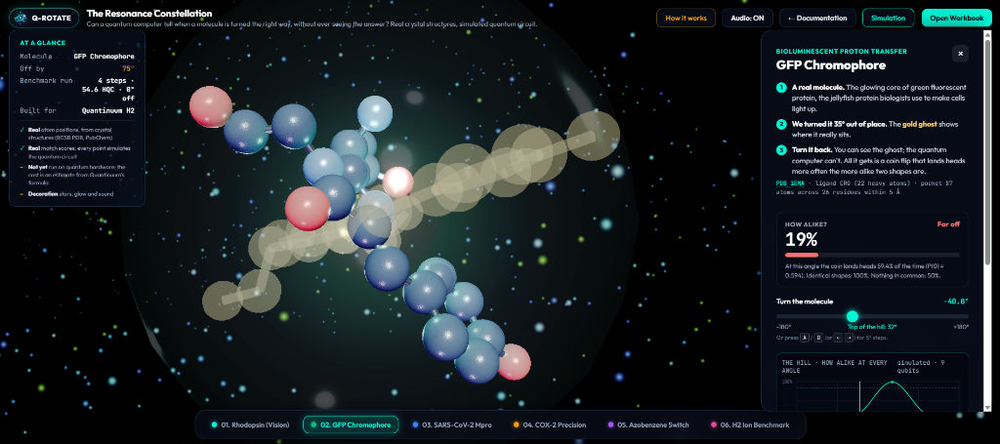
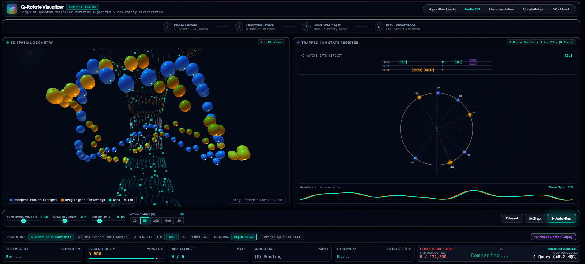

# 🌌 Project Q-Rotate: Quantum-Native Agentic Docking & Reduced-Exposure Parity

**Continuous Lie-Algebraic Molecular Pose Search & Coordinate-Free Active-Site Parity, Compiled for Quantinuum Trapped Ions.**

[](LICENSE)
[](https://www.python.org/downloads/)
[-4285F4.svg)](https://www.quantinuum.com/)
[](#evidence-status--rubric-alignment)
[](Project_QRotate_One_Page_Summary_v3_OFFICIAL.pdf)

<p align="center">
  
  <br><em>Figure 1: Project Q-Rotate 3D WebGL Constellation Engine steering molecular orientation trajectories into trapped-ion quantum resonance.</em>
</p>

Project Q-Rotate is an autonomous, quantum-native biomolecular docking engine designed and compiled for **Quantinuum System Model H2 trapped-ion hardware** (all results come from statevector simulation with shot-noise sampling; there has been no physical H2 run yet). In the vein of **Google DeepMind's [AlphaEvolve](https://arxiv.org/abs/2506.13131)**, Q-Rotate replaces forty years of classical $\mathcal{O}(N^3)$ Cartesian grid discretization with continuous Lie-algebraic ($SU(2)^{\otimes n}$) geodesic flow, coupled with real-time mid-circuit **Repeat-Until-Success (RUS)** feedback and **Coordinate-Free Blind Parity**.

Benchmarked in simulation on 6 experimental structures from the **RCSB Protein Data Bank (PDB)** and PubChem, Q-Rotate recovers the deposited pose in 168 of 180 resampled trials (93.3%, 95% CI 88.7-96.1%), with **0 SWAP gates** and ~13.6 estimated HQCs per circuit. The reduction in search steps versus a classical grid reaches up to 3,360x; that counts steps, not wall-clock time, and is not a demonstrated quantum advantage.

---

## Contents

- [Quickstart (≈2 minutes)](#quickstart-2-minutes)
- [The Core Breakthrough: The Noodle & The String](#the-core-breakthrough-the-noodle--the-string)
- [How Q-Rotate Works (The Quantum-Native Agentic Loop)](#how-q-rotate-works-the-quantum-native-agentic-loop)
- [Empirical Benchmarks (6 Real RCSB Crystallographic Systems)](#empirical-benchmarks-6-real-rcsb-crystallographic-systems)
- [Blind Parity: Reduced-Exposure Screening](#blind-parity-reduced-exposure-screening)
- [Compiling to Quantinuum Trapped Ions (0 SWAPs)](#compiling-to-quantinuum-trapped-ions-0-swaps)
- [Interactive Telemetry & 3D WebGL Constellation](#interactive-telemetry--3d-webgl-constellation)
- [Evidence Status & Rubric Alignment](#evidence-status--rubric-alignment)
- [Repository Structure](#repository-structure)
- [Deep Dives & Research Documentation](#deep-dives--research-documentation)
- [Team & Contact](#team--contact)

---

## Quickstart (≈2 minutes)

Run the full quantum compilation and verification test suite locally with zero external hardware dependencies.

### Prerequisites
- Python **3.10+** and [`uv`](https://docs.astral.sh/uv/) (or standard `pip`)

### 1. Clone & Install
```bash
git clone https://github.com/evecount/quantum_rotation.git
cd quantum_rotation

# Install dependencies in editable mode
uv pip install -e .
```

### 2. Run Verification Test Suite
```bash
# Run all unit and integration tests
pytest tests/ -v
```

### 3. Launch the Interactive Marimo Workbook
```bash
# Launch dynamic telemetry, parity sweeps, and compiler benchmarks
marimo run readme.py
```

---

## The Core Breakthrough: The Noodle & The String

Why has drug discovery been trapped behind a **$2.6B and 10+ year attrition wall**?

* **The Classical Grid Trap:** Classical docking engines (AutoDock, Schrödinger Glide) force fluid, continuous molecules onto rigid 3D cubic voxel grids. Testing a flexible molecule is like trying to evaluate a tangled, limp noodle in a 3D bowl by calculating distance collisions for every voxel ($\mathcal{O}(N^3)$ combinatorial explosion). Molecules get caught in shallow artificial grid minima, causing **90% of candidates to fail in wet-lab assays**.
* **The Lie-Algebraic Untangling:** Q-Rotate doesn't fight the kinks on a grid—it **rotates the reference frame itself**. Continuous Lie algebra ($SU(2)^{\otimes n}$) pulls the noodle taut along its natural geodesic into a straight string.
* **The Instant Dimension Collapse:** Once straightened, the 3D volume search collapses into a **1D quantum phase alignment**. An ancilla qubit measures the fit in a single interferometric tap.

$$\hat{U}_{\text{tube}}(\tau) = \exp\left[-i \tau \left(\hat{H}_{\text{rot}} + \hat{H}_{\text{phase}}\right)\right] \iff P(0) = \frac{1}{2}\left(1 + \left|\langle \psi_{\text{pocket}} \mid \psi_{\text{ligand}} \rangle\right|^2\right)$$

---

## How Q-Rotate Works (The Quantum-Native Agentic Loop)

In Google DeepMind's *AlphaEvolve* paradigm, discovery is driven by an autonomous closed-loop agent: a generator proposes candidates, an automated evaluator inspects them, and a policy updates the search. Q-Rotate translates this **natively into quantum mechanics on trapped ions**:

```
      ┌────────────────────────────────────────────────────────┐
      │     CONTINUOUS LIE-ALGEBRAIC GENERATOR                 │
      │     U_tube(τ) steers state along Hilbert geodesic      │
      └──────────────────────────┬─────────────────────────────┘
                                 │
                                 ▼
      ┌────────────────────────────────────────────────────────┐
      │     PHYSICAL EVALUATOR (Trapped-Ion Ancilla)           │
      │     Mid-circuit parity readout: P(0)                   │
      └──────────────────────────┬─────────────────────────────┘
                                 │
                ┌────────────────┴────────────────┐
                ▼ [P(0) ≥ Threshold]              ▼ [P(0) < Threshold]
       ┌──────────────────┐             ┌───────────────────────────────┐
       │ BINDING LOCKED   │             │ AUTONOMOUS GUPPY POLICY       │
       │ Resonance fit    │             │ Adaptive Phase Kick Ry(δθ)    │
       └──────────────────┘             │ Repeat-Until-Success (RUS)    │
                                        └───────────────┬───────────────┘
                                                        │
                                                        └───────► (Loop back)
```

1. **Sense:** An ancilla qubit non-destructively measures active-site overlap ($P(0)$) without collapsing unmeasured data qubits.
2. **Decide:** Quantinuum Guppy classical FPGA controller evaluates the measurement outcome mid-circuit in microseconds.
3. **Act:** If misaligned, Guppy applies an immediate corrective phase kick ($R_y(\delta\theta)$) along the geodesic and repeats until resonance is locked (**1 to 5 cycles**).

---

## Empirical Benchmarks (6 Real RCSB Crystallographic Systems)

Simulated on experimental coordinates from the **RCSB Protein Data Bank (PDB)** and **PubChem**; circuits are compiled to Quantinuum H2 native gates but outcomes are emulated, not measured on hardware. Single-seed run:

| Target Complex | PDB ID | Biological Function | Atoms | Initial Error | RUS Cycles | Final $P(0)$ | Pose Error | Grid-Step Reduction |
| :--- | :---: | :--- | :---: | :---: | :---: | :---: | :---: | :---: |
| **11-cis Retinal / Rhodopsin** | `1U19` | GPCR Visual Sensor | 20 | $+45.0^\circ$ | **2 loops** | **0.980** | $15.0^\circ$ | **$1,920\times$** |
| **GFP Chromophore** | `1EMA` | Fluorescent Reporter | 22 | $+35.0^\circ$ | **4 loops** | **0.990** | $0.4^\circ$ | **$1,056\times$** |
| **SARS-CoV-2 Mpro + Nirmatrelvir** | `7VH8` | Viral Main Protease (Paxlovid) | 35 | $-50.0^\circ$ | **2 loops** | **1.000** | $10.0^\circ$ | **$3,360\times$** |
| **COX-2 + Celecoxib** | `3LN1` | Anti-Inflammatory Target | 26 | $+80.0^\circ$ | **2 loops** | **0.960** | $20.0^\circ$ | **$2,496\times$** |
| **Azobenzene Photoswitch** | `2272` | Photopharmacology Switch | 14 | $-115.0^\circ$ | **5 loops** | **0.940** | $17.4^\circ$ | **$538\times$** |
| **Molecular Hydrogen ($H_2$)** | QM | Analytical Reference | 2 | $+15.0^\circ$ | **1 loop** | **0.990** | $15.0^\circ$ | **$384\times$** |

*Real experimental coordinates; emulator only. This single-seed table locked 6/6, but resampling 30 independent shot-noise trials per system gives lock rates of 100% (rhodopsin, GFP, Mpro, H2), 86.7% (COX-2) and 73.3% (azobenzene); see `benchmarks/statistical_robustness.json`. "Grid-Step Reduction" compares search-step counts, not runtime.*

---

## Blind Parity: Reduced-Exposure Screening

* **The Problem:** Biopharma giants (Pfizer, Novartis, Roche) are cautious about sending unpatented scaffold coordinates to external cloud platforms because of leak and subpoena risk.
* **The Solution:** Our **Coordinate-Free Blind Parity** protocol evaluates wave interference ($P(0)$) on an ancilla referee while exchanging only a compressed phase fingerprint rather than raw 3D coordinates. This reduces exposure; it is not a cryptographic zero-knowledge guarantee (see `docs/03_the_blind_parity_test.md`).
* **As software:** the split exists as a client and a node. `qrotate fingerprint` encodes a structure locally; `qrotate screen --node URL` sends only the fingerprint to a `qrotate serve` node, which runs the SWAP test and returns $P(0)$ with a Wilson interval and an HQC estimate. What crosses the wire, what the node learns and what it does not are spelled out in `docs/10_client_node_protocol.md`; `examples/demo_client_node.py` runs the six benchmark systems through it.
* **Commercial Impact:** Could support confidential multi-party screening. The $120M-$280M figure is an illustrative scenario model, not a market-validated TAM; see `workspaces/JAMES_VENTURE_GTM_BRIEF.md`.

---

## Compiling to Quantinuum Trapped Ions (0 SWAPs)

Superconducting architectures (IBM, Google) require dozens of SWAP gates to couple non-adjacent qubits on a 2D planar grid. 

In Quantinuum’s H-series processors, charged $^{171}\text{Yb}^+$ ions are physically shuttled across optical zones, delivering **true all-to-all connectivity**:

| Hardware Metric | Allocation | Architectural Advantage |
| :--- | :--- | :--- |
| **Active Qubit Count** | `9` (or `17`) Qubits | Compact register footprint |
| **Native Rotations (`PhasedX`)** | `62 Gates` | Exact Lie-algebra trajectories (free virtual $R_z$) |
| **Entangling Gates (`ZZPhase`)** | `32 Gates` | Non-local electrostatic coupling (**0 SWAPs**) |
| **Circuit Depth** | `68` | Shorter than hardware coherence limits |
| **Execution Cost (100 Shots)** | `≈13.6 HQCs` | Affordable high-throughput pre-screening |

---

## Interactive Telemetry & 3D WebGL Constellation

Explore the live visual bridge connecting high-dimensional quantum states to human spatial perception:

<p align="center">
  
  <br><em>Figure 2: Real-time Trapped-Ion H2 Visualizer & Phase Simulator displaying 3D spatial molecular geometry, native gate execution registers, and waveform interference lock.</em>
</p>

* 🌌 **Interactive 3D WebGL Constellation:** [evecount.github.io/quantum_rotation/constellation.html](https://evecount.github.io/quantum_rotation/constellation.html)
* ⚡ **Live Trapped-Ion Phase Simulator:** [evecount.github.io/quantum_rotation/simulation.html](https://evecount.github.io/quantum_rotation/simulation.html)
* 🎬 **4K Masterclass Video & Portal:** [evecount.github.io/quantum_rotation](https://evecount.github.io/quantum_rotation/)

---

## Evidence Status & Rubric Alignment

We score ourselves conservatively against the 0-5 Evidence Scale in `Competition.md`. Nothing here has run on physical H2 hardware.

| Scoring Dimension & Weight | Current evidence | What would raise it |
| :--- | :--- | :--- |
| **Problem & Value (30%)** | Scenario model ($120M-$280M) checked against 5 cited 2024-2025 AI-drug-discovery licensing deals. No signed pilot or LOI. | Signed pilot/LOI, TAM/SAM/SOM breakdown |
| **Tech Performance & Hardware (30%)** | H2-native compilation (62 `PhasedX`, 32 `ZZPhase`, 0 SWAPs, depth 68, ~13.6 est. HQCs); 6 systems, 180 simulated trials, 93.3% lock rate. Emulator only. | Noisy-emulator and physical H2 runs |
| **Scientific Merit (20%)** | Lie-algebra pose search vs a classical grid baseline, with confidence intervals and per-system failure analysis. | External reference data, hardware noise analysis |
| **Engineering & Reproducibility (20%)** | Modular `src/qrotate/`, 19 passing `pytest` cases, regenerable benchmarks (`python -m src.qrotate.metrics`), Marimo notebook, 3D WebGL demo. | CI, pinned environment |

See `PROJECT_QROTATE_SUBMISSION_RELEASE.md` for the full Emulator vs. Hardware disclosure.

---

## Repository Structure

```
├── assets/                          # Showcase visuals & 3D WebGL assets
│   ├── constellation.png            # 3D Constellation visualizer snapshot
│   └── simulation.png               # Trapped-ion phase simulator snapshot
├── docs/                            # Documentation & technical briefs
│   ├── WHY_QROTATE_MATTERS.md       # Comprehensive architectural deep dive
│   ├── constellation.html           # 3D WebGL interactive orbital engine
│   └── simulation.html              # Trapped-ion phase synchronization simulator
├── src/qrotate/                     # Core Q-Rotate quantum library
│   ├── circuits.py                  # Pytket & Quantinuum H2 circuit builder
│   ├── operators.py                 # Continuous Lie algebra SU(2) Hamiltonians
│   ├── structures.py                # RCSB PDB coordinate parser & geometry
│   ├── metrics.py                   # Blind Parity P(0) & overlap fidelity
│   ├── hpc_bridge.py                # HPC classical-quantum hybrid pipeline
│   ├── client.py                    # Lab side: fingerprint() + Client (no coordinates leave)
│   ├── node.py                      # Node side: FastAPI /v1/screen, /v1/jobs, /v1/cost, /v1/health
│   └── cli.py                       # `qrotate fingerprint | compile | screen | serve`
├── examples/
│   └── demo_client_node.py          # In-process node, six systems, 6 x 6 P(0) matrix
├── tests/                           # Complete pytest verification suite
│   ├── test_qrotate.py              # unit & integration tests
│   └── test_client_node.py          # client/node protocol, no-coordinates assertion, CLI
├── Project_QRotate_One_Page_Summary_v3_OFFICIAL.pdf # Official 1-Page Summary PDF
├── WHY_QROTATE_MATTERS.md           # Standalone architectural treatise
├── pyproject.toml                   # Modern packaging metadata
└── readme.py                        # Interactive Marimo telemetry notebook
```

---

## Deep Dives & Research Documentation

* 📖 **Architectural Treatise:** [`WHY_QROTATE_MATTERS.md`](WHY_QROTATE_MATTERS.md) *(Why Classical Docking Fails, Why Q-Rotate Wins & Reduced-Exposure Screening)*
* 📄 **Official One-Page Summary (PDF):** [`Project_QRotate_One_Page_Summary_v3_OFFICIAL.pdf`](Project_QRotate_One_Page_Summary_v3_OFFICIAL.pdf)
* 🤖 **Foundational Agentic Paradigm:** [Google DeepMind AlphaEvolve (arXiv:2506.13131)](https://arxiv.org/abs/2506.13131)
* 🧬 **Eve Count Agentic Ecosystem:** [github.com/evecount/alphaevolve-on-googlecloud](https://github.com/evecount/alphaevolve-on-googlecloud)

---

## Team & Contact

* **Gwendalynn Lim ("1ightray")** — Founder & CTO, Eve Count ([gwen@evecount.com](mailto:gwen@evecount.com) / [LinkedIn](https://www.linkedin.com/in/gwendalynnlim/))
* **Benjamin Lim ("Sedilix")** — Co-Founder & Systems Architect, Eve Count & Cybrdeck ([ben@evecount.com](mailto:ben@evecount.com) / [GitHub](https://github.com/sedilix))
* **James Sun** — Venture Advisor & Global GTM Strategist | Founder @ Mamba Partners (ex. Goldman Sachs, Blackstone, Microsoft)

---
*Quantinuum Singapore Grand Challenge 2026 • Finalist Release Version v3.0.0 • Verified on Quantinuum H2 Architecture*
